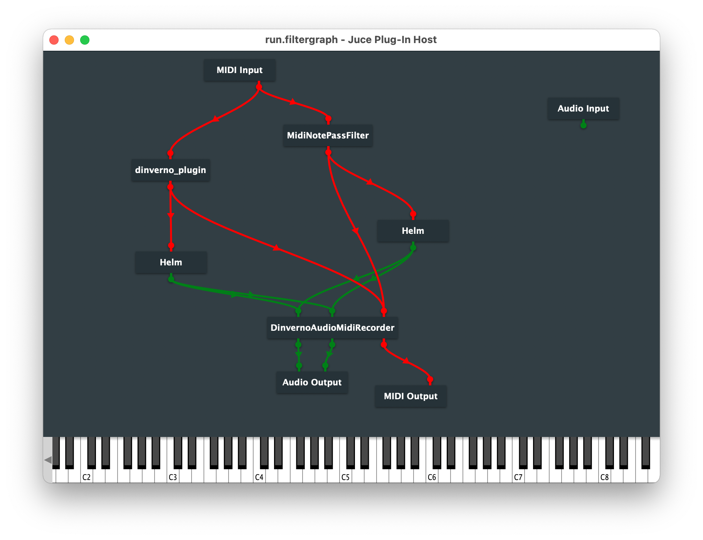

# Markov Visualisation

A project about visualising the inner workings and output of the AI-based music accompanist & improviser [goldash-system](https://github.com/yeeking/goldash-system).

## Using the Visualisation

### Dependencies

* Requires the following Processing libraries: 
	* [oscP5](http://www.sojamo.de/libraries/oscP5/) — for receiving OSC messages
	* [grafica](https://jagracar.com/grafica.php) — for graphs & plotting
	* [MidiBus](http://www.smallbutdigital.com/projects/themidibus/) — for detecting MIDI input
	* [ControlP5](https://www.sojamo.de/libraries/controlP5/) — for GUI user input/interaction

### Setup & executing program

* Ensure OSC message listening port is same as system's outgoing port (default 9001) and on (if using OSC mode)
* Ensure JUCE application interface is setup as shown below:
	* 
	* On macOS, navigate to AudioMidiSetup → MidiStudio → IAC Driver Window, and add a second bus "Bus 2" and apply the changes.
	* Restart the JUCE Plug-In Host window and navigate to audio settings, ensuring MIDI input is set to just IAC Driver Bus 1, and MIDI output is IAC Driver Bus 2.
* Run `visualization_main.pde` alongside system (ideally before starting to play)
* Visualisation can be tweaked real-time by **pressing the spacebar** to toggle the options window with the following settings:
  * **Modes**
  	* Graph/keyboard toggle between graph view and keyboard heat map
  	* MIDI enables preferred MIDI input rather than OSC messages
  * **Visualisation**
  	1. Filled line plot
  	2. Stroke line plot
  	3. Coloured histogram plot
  * **Options**
  	* Split keys — enable splitting keys in favour of overlapping colour
  	* Post-analysis — enable viewing of entire performance statistics
  	* Key signature — enable visualisation's guess of current key signature based on input
  	* Frequency labels — enable normalized frequency labels of keys
  	* Moving averages — enable points on visualisation that display average location on keyboard for human/system
### Modes of Operation

#### 1. Open Sound Control (OSC)

Not preferred. Receive key presses & system output via OSC messages clocked by the system every second. This means there is a (<1s) lag between pressing keys and the consequent visualisation. The default port for OSC messages sent by the system is 9001 (on localhost).

#### 2. MIDI

Preferred. Receive key presses & system output via MIDI input from user and system. No lag & instantaneous visualisation.

### Debugging

* In case of failure program can be run in debugging mode by setting `debugMode` to `true` in `visualization_main.pde`
* As a failsafe, visualisation can be altered with specific key presses. These are:
	* `c` — resets & clears visualisation's memory
	* `s` — toggles split keys
	* `p` — toggles post analysis 
	* `k` — toggles display of key signature text
	* `m` — changes mode of operation (MIDI/OSC)
	* `g` — changes between keyboard/graph view
	* `v` — cycles through graph visuals (line/histogram/contour)

### Additional information

* Built entirely under Processing 3.5.4

## Acknowledgements

* HSL to RGB Java conversion done by [camick.com](http://www.camick.com/java/source/HSLColor.java)